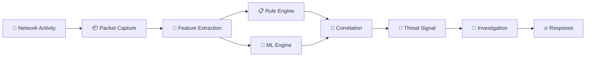
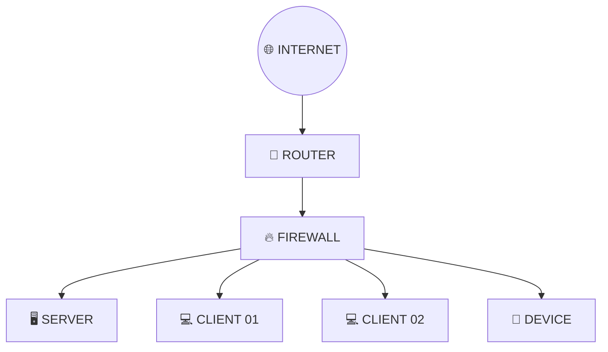
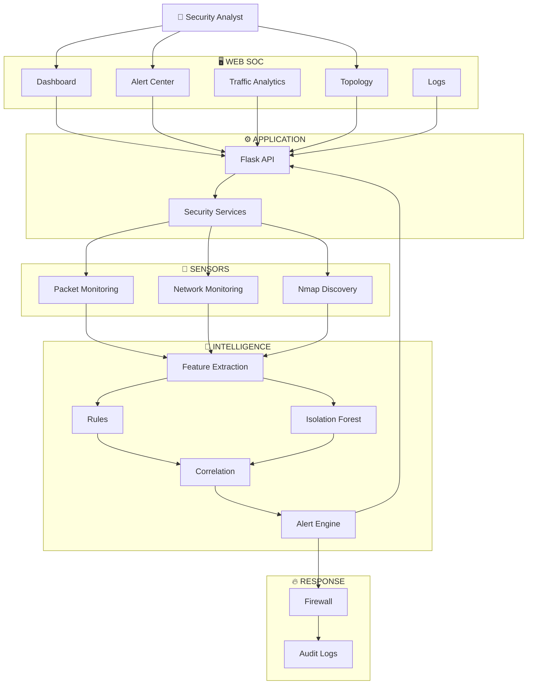
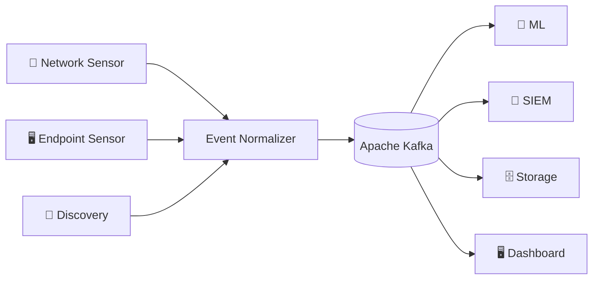

<div align="center">


<br>


<br><br>


<br><br>


<br><br>

### **See the Network • Understand the Signal • Detect the Threat • Defend the System**

<br>

[](#-overview)
[](#-architecture)
[](#-quick-start)
[](#-roadmap)

</div>

---

<div align="center">

```text id="n7y0fk"
╔══════════════════════════════════════════════════════════════════════════╗
║                         NETSENTINEL CORE                                ║
╠══════════════════════════════════════════════════════════════════════════╣
║                                                                          ║
║   📡 TELEMETRY     🧠 INTELLIGENCE      🚨 DETECTION      🔥 RESPONSE   ║
║                                                                          ║
║       ●──────────────●──────────────●──────────────●                    ║
║       │              │              │              │                    ║
║       ▼              ▼              ▼              ▼                    ║
║    OBSERVE        ANALYZE         DETECT         DEFEND                 ║
║                                                                          ║
║                 ◉ SECURITY SIGNALS FLOWING ◉                           ║
╚══════════════════════════════════════════════════════════════════════════╝
```

</div>

<br>

# 🌐 Overview

> **NetSentinel is an AI-assisted network security monitoring and threat-detection platform built to transform raw network activity into actionable security intelligence.**

NetSentinel combines:

```text id="b9x4hf"
📡 Network Monitoring
        │
        ▼
🔎 Network Discovery
        │
        ▼
🧮 Feature Extraction
        │
        ├───────────────┐
        ▼               ▼
📋 Rule Detection   🧠 ML Detection
        │               │
        └───────┬───────┘
                ▼
          🔗 Correlation
                │
                ▼
          🚨 Threat Signal
                │
        ┌───────┴───────┐
        ▼               ▼
   🖥️ SOC View      🔥 Response
```

---

# ⚡ The Security Loop

<div align="center">


</div>

---

# 🛰️ Live Security Visualization

```text id="7xw3jd"
┌────────────────────────────────────────────────────────────────────────┐
│ NETSENTINEL // SECURITY OPERATIONS CENTER                  ● LIVE      │
├────────────────────────────────────────────────────────────────────────┤
│                                                                        │
│  NETWORK       THREATS        ANOMALIES       HOSTS       EVENTS       │
│                                                                        │
│    LIVE           04              02            17          1,842       │
│                                                                        │
├────────────────────────────────────────────────────────────────────────┤
│                                                                        │
│  LIVE TELEMETRY                                                        │
│                                                                        │
│  ● 10.0.0.12  ─────────► 10.0.0.1       TCP       NORMAL              │
│  ● 10.0.0.18  ─────────► 8.8.8.8        UDP       NORMAL              │
│  ● 10.0.0.21  ─────────► remote-host     TCP       ⚠ ANOMALY           │
│  ● 10.0.0.31  ─────────► 10.0.0.8        TCP       NORMAL              │
│                                                                        │
├────────────────────────────────────────────────────────────────────────┤
│                                                                        │
│  THREAT SIGNAL                                                         │
│                                                                        │
│  ████████████████████████████░░░░░░░░░░░░░  72%                       │
│                                                                        │
└────────────────────────────────────────────────────────────────────────┘
```

<div align="center">


</div>

---

# ✨ Capabilities

<table>
<tr>
<td align="center" width="33%">

### 📡

**NETWORK MONITORING**

Real-time network activity observation and traffic analysis.

</td>

<td align="center" width="33%">

### 🧠

**AI ANOMALY DETECTION**

Isolation Forest-based detection of unusual behavior.

</td>

<td align="center" width="33%">

### 🚨

**THREAT ALERTING**

Turn suspicious signals into actionable security events.

</td>
</tr>

<tr>
<td align="center">

### 🔎

**NETWORK DISCOVERY**

Discover hosts, ports and services through Nmap.

</td>

<td align="center">

### 🗺️

**TOPOLOGY**

Visualize discovered network relationships.

</td>

<td align="center">

### 🔥

**DEFENSIVE RESPONSE**

Controlled firewall-oriented security actions.

</td>
</tr>

<tr>
<td align="center">

### 📊

**TRAFFIC ANALYTICS**

Understand network behavior through visualization.

</td>

<td align="center">

### 📝

**SECURITY LOGGING**

Maintain investigation and audit information.

</td>

<td align="center">

### 🖥️

**SOC DASHBOARD**

Unified security visibility for analysts.

</td>
</tr>
</table>

---

# 🧠 AI Threat Detection

NetSentinel uses **Isolation Forest** as an anomaly-detection component.

```text id="1j5dzw"
                         ┌─────────────────┐
                         │ NETWORK TRAFFIC │
                         └────────┬────────┘
                                  │
                                  ▼
                         ┌─────────────────┐
                         │     CAPTURE     │
                         └────────┬────────┘
                                  │
                                  ▼
                         ┌─────────────────┐
                         │    FEATURES     │
                         └────────┬────────┘
                                  │
                                  ▼
                       ╔═════════════════════╗
                       ║  ISOLATION FOREST   ║
                       ╚══════════╤══════════╝
                                  │
                         ┌────────┴────────┐
                         ▼                 ▼
                     NORMAL             ANOMALY
                         │                 │
                         │                 ▼
                         │          ┌────────────┐
                         │          │   THREAT   │
                         │          │   SIGNAL   │
                         │          └─────┬──────┘
                         │                │
                         └───────┬────────┘
                                 ▼
                           ALERT ENGINE
```

<div align="center">


</div>

> **Important:** ML output is a detection signal, not an unquestionable source of truth. Production deployment requires representative data, validation and appropriate threshold tuning.

---

# 🚨 Threat Detection Pipeline



---

# 🔎 Network Discovery

Nmap provides the discovery layer for understanding the visible network.

```text id="s1k6b4"
                     TARGET NETWORK
                           │
                           ▼
                     ┌───────────┐
                     │   NMAP    │
                     └─────┬─────┘
                           │
             ┌─────────────┼─────────────┐
             ▼             ▼             ▼
          🖥️ HOSTS      🔌 PORTS      ⚙️ SERVICES
             │             │             │
             └─────────────┼─────────────┘
                           ▼
                  ┌────────────────┐
                  │ NETWORK ASSETS  │
                  └───────┬────────┘
                          ▼
                  SECURITY CONTEXT
```

---

# 🗺️ Network Topology



---

# 🔥 Response Lifecycle

<div align="center">

```text
🚨 DETECTION
      ↓
🔎 VALIDATION
      ↓
📊 SEVERITY
      ↓
🧠 POLICY
      ↓
🔥 RESPONSE
      ↓
📝 AUDIT
      ↓
📈 ANALYSIS
```


</div>

---

# 🏗️ Architecture



---

# 🔄 Security Lifecycle

<div align="center">

| # | Stage | Purpose |
|:---:|:---|:---|
| `01` | 📡 **COLLECT** | Capture network telemetry |
| `02` | 🧮 **PROCESS** | Normalize traffic information |
| `03` | 🧠 **ANALYZE** | Apply rules and ML |
| `04` | 🔗 **CORRELATE** | Connect related signals |
| `05` | 🚨 **DETECT** | Generate threat events |
| `06` | 🔎 **INVESTIGATE** | Analyze evidence |
| `07` | 🔥 **RESPOND** | Apply authorized controls |
| `08` | 📝 **AUDIT** | Preserve the event history |

</div>

---

# 🖥️ SOC Experience

The dashboard is intended to feel like a **live security command center**.

```text id="s7g1fv"
╭────────────────────────────────────────────────────────────────╮
│ NETSENTINEL                                      ● CONNECTED   │
├────────────────────────────────────────────────────────────────┤
│                                                                │
│  NETWORK        THREATS        ANOMALIES        HOSTS           │
│  ───────        ───────        ────────        ─────           │
│    LIVE            04              02             17            │
│                                                                │
├────────────────────────────────────────────────────────────────┤
│                                                                │
│  NETWORK TOPOLOGY                  THREAT ACTIVITY             │
│                                                                │
│       ●─────●                         ████████████              │
│      /       \                        ██████                    │
│     ●         ●                       ███████████████           │
│                                                                │
├────────────────────────────────────────────────────────────────┤
│                                                                │
│  SECURITY EVENTS                                               │
│                                                                │
│  12:41:08   INFO       Traffic within baseline                 │
│  12:41:09   WARNING    Unusual connection pattern              │
│  12:41:11   ALERT      Anomaly detected                        │
│                                                                │
╰────────────────────────────────────────────────────────────────╯
```

---

# 📊 Security Signal Matrix

| Layer | Input | Output |
|:---|:---|:---|
| 📡 Monitoring | Packets / Traffic | Telemetry |
| 🔎 Discovery | Network | Assets |
| 🧮 Features | Traffic | Vectors |
| 📋 Rules | Events | Rule matches |
| 🧠 ML | Feature vectors | Anomaly signals |
| 🔗 Correlation | Signals | Context |
| 🚨 Alerting | Detections | Alerts |
| 🔥 Response | Alerts | Defensive actions |
| 📝 Logging | Events | Audit trail |

---

# ⚙️ Technology Stack

<div align="center">

```text
                         NETSENTINEL
                              │
          ┌───────────────────┼───────────────────┐
          │                   │                   │
          ▼                   ▼                   ▼
       BACKEND            INTELLIGENCE         FRONTEND
          │                   │                   │
       Python              Scikit-learn        React
       Flask               Isolation Forest    Vite
          │                   │                   │
          └───────────────────┼───────────────────┘
                              │
                       NETWORK LAYER
                              │
                         Nmap / Capture
```

</div>

---

# 📁 Project Structure

```text id="h3n7qg"
NetSentinel/
│
├── backend/
│   ├── app.py
│   ├── config.py
│   ├── detection/
│   ├── monitoring/
│   ├── network/
│   ├── firewall/
│   └── utils/
│
├── frontend/
│   ├── package.json
│   ├── vite.config.*
│   ├── src/
│   │   ├── components/
│   │   ├── pages/
│   │   ├── services/
│   │   └── ...
│   └── public/
│
├── data/
├── logs/
├── requirements.txt
└── README.md
```

---

# 🚀 Quick Start

### 01 — Clone

```bash
git clone https://github.com/YOUR_USERNAME/NetSentinel.git
cd NetSentinel
```

### 02 — Create environment

```bash
python -m venv venv
```

### 03 — Activate

**Windows**

```powershell
venv\Scripts\activate
```

**Linux / macOS**

```bash
source venv/bin/activate
```

### 04 — Install dependencies

```bash
pip install -r requirements.txt
```

### 05 — Install Nmap

Download:

https://nmap.org/download.html

Verify:

```bash
nmap --version
```

### 06 — Start backend

```bash
python app.py
```

### 07 — Start frontend

```bash
cd frontend
npm install
npm run dev
```

---

# 🪟 Windows Notes

Depending on the packet-capture implementation, Windows may require **Npcap**.

Some network and firewall operations may also require elevated privileges.

Use only the permissions necessary for the functionality being executed.

---

# 🧪 Safe Testing

Use NetSentinel only against systems and networks you own or are authorized to test.

```text id="4w3d0a"
        🧪 CONTROLLED LAB
                │
                ▼
        📡 TEST TELEMETRY
                │
                ▼
        🧮 FEATURE ENGINE
                │
        ┌───────┴───────┐
        ▼               ▼
      📋 RULES         🧠 ML
        │               │
        └───────┬───────┘
                ▼
             🚨 ALERT
                │
                ▼
           🔎 VERIFY
                │
                ▼
             📝 LOG
```

---

# 🔐 Security Principles

### 🔒 Least Privilege

Use only the privileges required.

### 🧾 Evidence First

Base decisions on observable security evidence.

### 🎯 Explicit Authorization

Only monitor authorized systems.

### 📝 Auditable Actions

Record security-sensitive operations.

### 🛑 Controlled Automation

Keep potentially disruptive response actions behind appropriate safeguards.

### 🧠 AI-Assisted, Not AI-Decided

ML should assist investigation rather than replace evidence or human oversight.

---

# 📨 Future Kafka Architecture

Kafka can become the event backbone as NetSentinel grows.



Future benefits:

- Distributed sensors
- High-volume event ingestion
- Event replay
- Multiple consumers
- Stream processing
- Centralized analytics

---

# 🔭 Future SIEM Ecosystem

```text id="x4h5gi"
                      NETSENTINEL
                           │
                           ▼
                    SECURITY EVENTS
                           │
                           ▼
                   EVENT NORMALIZER
                           │
                           ▼
                     EVENT STREAM
                           │
             ┌─────────────┼─────────────┐
             ▼             ▼             ▼
          SPLUNK         WAZUH       OPENSEARCH
             │             │             │
             └─────────────┼─────────────┘
                           ▼
                     SECURITY SOC
```

Potential future integrations:

`Kafka` • `Splunk` • `Wazuh` • `OpenSearch` • `Elasticsearch` • `Grafana` • `SOAR`

---

# 🤖 Future AI Security Assistant

```text id="7kpr1m"
                 🚨 SECURITY ALERT
                        │
                        ▼
                 📦 EVIDENCE
                        │
                        ▼
                 🧠 AI ANALYSIS
                        │
             ┌──────────┼──────────┐
             ▼          ▼          ▼
          EXPLAIN    SUMMARIZE   CORRELATE
             │          │          │
             └──────────┼──────────┘
                        ▼
                  👤 ANALYST
                        │
                        ▼
                 HUMAN DECISION
```

Possible future capabilities:

- Alert explanation
- Incident summaries
- Investigation timelines
- Event correlation
- Natural-language security queries
- Detection-rule assistance
- Evidence-based recommendations

---

# 🌌 Platform Vision

<div align="center">


</div>

```text id="8a8r5h"
NETWORK MONITOR
       │
       ▼
THREAT DETECTION
       │
       ▼
SECURITY INTELLIGENCE
       │
       ▼
EVENT STREAMING
       │
       ▼
SIEM INTEGRATION
       │
       ▼
AI INVESTIGATION
       │
       ▼
CONTINUOUS DEFENSE
```

---

# 🗺️ Roadmap

## 🟢 FOUNDATION

- [x] Network monitoring
- [x] Packet analysis
- [x] Nmap discovery
- [x] Flask backend
- [x] React frontend
- [x] ML anomaly detection
- [x] Security alerts
- [x] Traffic visualization
- [x] Network topology
- [x] Firewall capabilities

## 🔵 INTELLIGENCE

- [ ] Persistent event database
- [ ] Behavioral baselines
- [ ] Threat intelligence
- [ ] DNS intelligence
- [ ] IP reputation
- [ ] Advanced correlation
- [ ] Detection-rule management

## 🟣 STREAMING

- [ ] Kafka event pipeline
- [ ] Standard event schemas
- [ ] Distributed sensors
- [ ] Stream processing
- [ ] Event replay
- [ ] High-volume telemetry

## 🟠 SOC

- [ ] Incident management
- [ ] Investigation timeline
- [ ] Evidence collection
- [ ] Case management
- [ ] Analyst notes
- [ ] RBAC
- [ ] Audit trails

## 🔴 ADVANCED PLATFORM

- [ ] AI investigation assistant
- [ ] SIEM integrations
- [ ] SOAR integrations
- [ ] Endpoint telemetry
- [ ] Cloud telemetry
- [ ] Automated playbooks
- [ ] Distributed deployment
- [ ] Production observability

---

# 🧭 Development Flow

```text id="n6k39u"
     ┌──────────┐
     │   CODE   │
     └────┬─────┘
          ↓
     ┌──────────┐
     │  BUILD   │
     └────┬─────┘
          ↓
     ┌──────────┐
     │   TEST   │
     └────┬─────┘
          ↓
     ┌──────────┐
     │ TELEMETRY│
     └────┬─────┘
          ↓
     ┌──────────┐
     │  DETECT  │
     └────┬─────┘
          ↓
     ┌──────────┐
     │  VERIFY  │
     └────┬─────┘
          ↓
     ┌──────────┐
     │   LOG    │
     └────┬─────┘
          ↓
     ┌──────────┐
     │   SHIP   │
     └──────────┘
```

---

# 🤝 Contributing

```bash
git checkout -b feature/my-feature

git add .

git commit -m "feat: improve threat detection"

git push origin feature/my-feature
```

Open a pull request containing:

- What changed
- Why it changed
- Testing performed
- Security considerations
- Relevant screenshots

---

# 🛡️ Responsible Use

NetSentinel is intended for:

- Defensive cybersecurity
- Authorized network monitoring
- Security research
- Educational environments
- Cybersecurity laboratories
- Network administration
- Systems owned by the operator

Do not use NetSentinel to monitor, scan, disrupt or interfere with systems or networks without authorization.

---

# 📜 License

Add the actual license for the repository here.

Example:

```text
MIT License
```

---

<div align="center">

<br>


<br><br>


<br><br>


<br><br>

### **SEE THE NETWORK. UNDERSTAND THE SIGNAL. DEFEND THE SYSTEM.**

<br>

⭐ **Star the repository if you find NetSentinel useful.**

</div>
